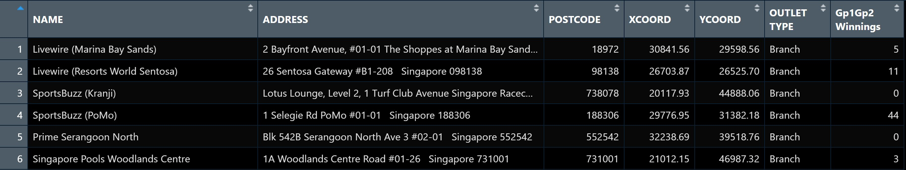
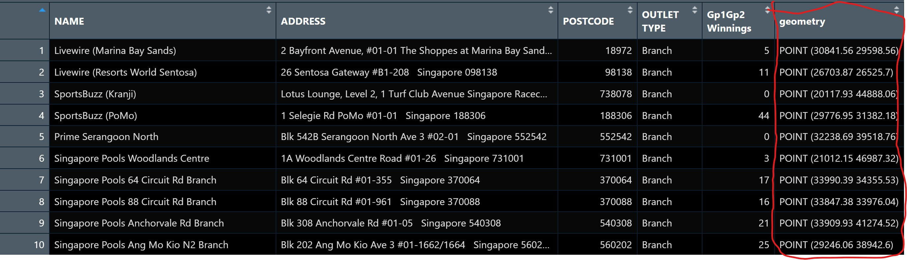

# [8-2:]{style="color:DarkOrange"} 1 Overview

Proportional symbol maps (also known as graduate symbol maps) are a class of maps that use the visual variable of size to represent differences in the magnitude of a discrete, abruptly changing phenomenon, e.g. counts of people.

Like choropleth maps, classed or unclassed versions of these maps can be created. The classed ones are known as range-graded or graduated symbols, and the unclassed are called proportional symbols, where the area of the symbols are proportional to the values of the attribute being mapped.

This hands-on exercise will cover how to create a proportional symbol map showing the number of wins by Singapore Pools’ outlets using an R package called **tmap**.

## [8-2:]{style="color:DarkOrange"} 1.1 Learning Outcomes

Objectives:

-   To import an aspatial data file into R.
-   To convert it into simple point feature data frame and at the same time, to assign an appropriate projection reference to the newly create simple point feature data frame.
-   To plot interactive proportional symbol maps.

# [8-2:]{style="color:DarkOrange"} 2 Getting Started

The code below ensures that the **tmap** package of R and other related R packages have been installed and loaded into R.

```{r}
#| code-fold: true
#| code-summary: "Show Code"
pacman::p_load(sf, tmap, tidyverse)
```

# [8-2:]{style="color:DarkOrange"} 3 Geospatial Data Wrangling

## [8-2:]{style="color:DarkOrange"} 3.1 Data

The data set use for this hands-on exercise is called *SGPools_svy21*. The data is in csv file format.

Figure below shows the first 15 records of SGPools_svy21.csv. It consists of seven columns. The XCOORD and YCOORD columns are the x-coordinates and y-coordinates of SingPools outlets and branches. THe data can be found from [Singapore SVY21 Projected Coordinates System](https://www.sla.gov.sg/sirent/CoordinateSystems.aspx).

{fig-align="center" width="800"}

## [8-2:]{style="color:DarkOrange"} 3.2 Data Import and Preparation

The code chunk below uses *read_csv()* function of **readr** package to import *SGPools_svy21.csv* into R as a tibble data frame called *sgpools*.

```{r}
#| code-fold: true
#| code-summary: "Show Code"
sgpools <- read_csv("data/aspatial/SGPools_svy21.csv")
```

After importing the data file into R, the code chunk below allow for examination of the data file to check that it has been imported correctly.

```{r}
#| code-fold: true
#| code-summary: "Show Code"
list(sgpools) 
```

::: callout-note
The sgpools data in a tibble data frame and not the common R data frame
:::

## [8-2:]{style="color:DarkOrange"} 3.3 Creating a sf data frame from an aspatial data frame

The code chunk below converts sgpools data frame into a simple feature data frame by using *st_as_sf()* of **sf** package.

```{r}
#| code-fold: true
#| code-summary: "Show Code"
sgpools_sf <- st_as_sf(sgpools, 
                       coords = c("XCOORD", "YCOORD"),
                       crs= 3414)
```

::: callout-tip
## Things to learn from the code

-   The *coords* argument requires the column name of the x-coordinates to be provided first before the column name of the y-coordinates.
-   The *crs* argument requires the coordinates system to be in epsg format. [EPSG: 3414](https://epsg.io/3414) is Singapore SVY21 Projected Coordinate System. Other country’s epsg code can be found by referring to [epsg.io](https://epsg.io/).
:::

The figure below shows the data table of *sgpools_sf*. Note that a new column called geometry has been added into the data frame.

{fig-align="center" width="800"}

The basic information of the newly created sgpools_sf can be displayed using the code chunk below.

```{r}
#| code-fold: true
#| code-summary: "Show Code"
list(sgpools_sf)
```

::: callout-tip
## Things to learn from the code

-   The output shows that sgppols_sf is in point feature class
-   It’s epsg ID is 3414
-   The bbox provides information of the extent of the geospatial data
:::

# [8-2:]{style="color:DarkOrange"} 4 Drawing Proportional Symbol Map

To create an interactive proportional symbol map in R, the view mode of tmap will be used.

The code churn below will turn on the interactive mode of tmap.

```{r}
#| code-fold: true
#| code-summary: "Show Code"
tmap_mode("view")
```

## [8-2:]{style="color:DarkOrange"} 4.1 Creating an Interactive Point Symbol Map

```{r}
#| code-fold: true
#| code-summary: "Show Code"
tm_shape(sgpools_sf)+
tm_bubbles(col = "red",
           size = 0.5,
           border.col = "black",
           border.lwd = 1)
```

## [8-2:]{style="color:DarkOrange"} 4.2 Make it Proportional

To draw a proportional symbol map, a numerical variable needs to be assigned to the size visual attribute. The code chunks below show that the variable *Gp1Gp2Winnings* is assigned to size visual attribute.

```{r}
#| code-fold: true
#| code-summary: "Show Code"
tm_shape(sgpools_sf)+
tm_bubbles(col = "red",
           size = "Gp1Gp2 Winnings",
           border.col = "black",
           border.lwd = 1)
```

## [8-2:]{style="color:DarkOrange"} 4.3 Change Colour

The proportional symbol map can be further improved by using the colour visual attribute. In the code chunks below, *OUTLET_TYPE* variable is used as the colour attribute variable.

```{r}
#| code-fold: true
#| code-summary: "Show Code"
tm_shape(sgpools_sf)+
tm_bubbles(col = "OUTLET TYPE", 
          size = "Gp1Gp2 Winnings",
          border.col = "black",
          border.lwd = 1)
```

## [8-2:]{style="color:DarkOrange"} 4.4 Make a twin

An impressive and little-know feature of **tmap**’s view mode is that it also works with faceted plots. The argument *sync* in *tm_facets()* can be used in this case to produce multiple maps with synchronised zoom and pan settings.

```{r}
#| code-fold: true
#| code-summary: "Show Code"
tm_shape(sgpools_sf) +
  tm_bubbles(col = "OUTLET TYPE", 
          size = "Gp1Gp2 Winnings",
          border.col = "black",
          border.lwd = 1) +
  tm_facets(by= "OUTLET TYPE",
            nrow = 1,
            sync = TRUE)
```

Before ending the session, it is wise to switch **tmap**’s Viewer back to plot mode by using the code chunk below.

```{r}
#| code-fold: true
#| code-summary: "Show Code"
tmap_mode("plot")
```

::: callout-tip
This is to prevent the next tmap call from generate an interactive map which may not be intended and can cause codes to fail
:::

# [8-2:]{style="color:DarkOrange"} 5 Reference

## [8-2:]{style="color:DarkOrange"} 5.1 All about tmap Package

-   [tmap: Thematic Maps in R](https://www.jstatsoft.org/article/view/v084i06)
-   [tmap](https://cran.r-project.org/web/packages/tmap/index.html)
-   [tmap: get started!](https://cran.r-project.org/web/packages/tmap/vignettes/tmap-getstarted.html)
-   [tmap: changes in version 2.0](https://cran.r-project.org/web/packages/tmap/vignettes/tmap-changes-v2.html)
-   [tmap: creating thematic maps in a flexible way (useR!2015)](http://von-tijn.nl/tijn/research/presentations/tmap_user2015.pdf)
-   [Exploring and presenting maps with tmap (useR!2017)](http://von-tijn.nl/tijn/research/presentations/tmap_user2017.pdf)

::: callout-note
Multiple links are broken
:::

## [8-2:]{style="color:DarkOrange"} 5.2 Geospatial Data Wrangling

-   [sf: Simple Features for R](https://cran.r-project.org/web/packages/sf/index.html)
-   [Simple Features for R: StandardizedSupport for Spatial Vector Data](https://journal.r-project.org/archive/2018/RJ-2018-009/RJ-2018-009.pdf)
-   [Reading, Writing and Converting Simple Features](https://cran.r-project.org/web/packages/sf/vignettes/sf2.html)

## [8-2:]{style="color:DarkOrange"} 5.3 Data Wrangling

-   [dplyr](https://dplyr.tidyverse.org/)
-   [Tidy data](https://cran.r-project.org/web/packages/tidyr/vignettes/tidy-data.html)
-   [tidyr: Easily Tidy Data with ‘spread()’ and ‘gather()’ Functions](https://cran.r-project.org/web/packages/tidyr/tidyr.pdf)
